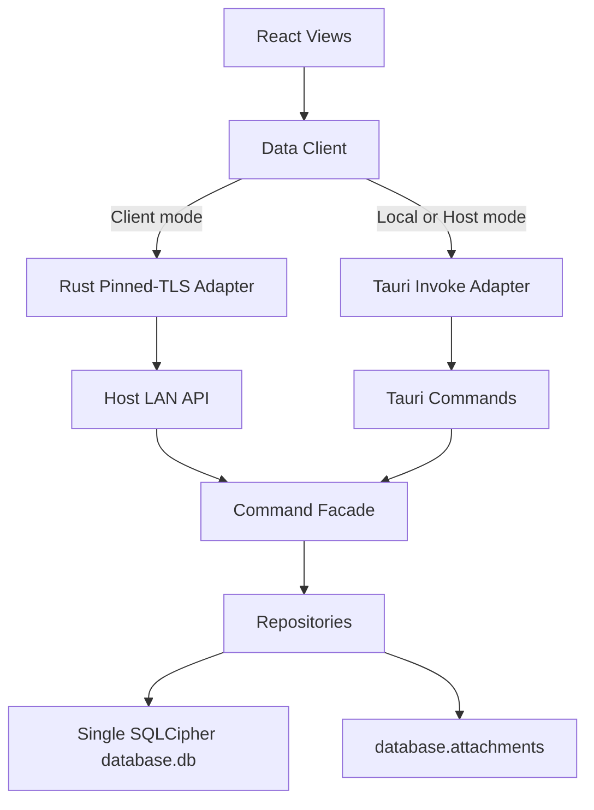

# LAN Host/Client Mode Design

**Spec**: `.specs/features/lan-host-client/spec.md`
**Context**: `.specs/features/lan-host-client/context.md`
**Status**: Draft

---

## Architecture Overview

The first implementation uses a host-owned HTTPS API server. The host process initializes the existing local SQLCipher database exactly as stable `main` does today, then starts an authenticated LAN API server with a locally generated TLS certificate. Client processes store connection settings and the pinned host certificate fingerprint locally, avoid opening the shared production database, and call the host through a Rust transport command behind the frontend data-client abstraction.



### Approach Trade-Offs

| Approach | Summary | Pros | Cons | Decision |
| --- | --- | --- | --- | --- |
| Host-owned API server | One host owns SQLite locally; clients call product APIs. | Preserves SQLite semantics, avoids network filesystem locking, reuses commands and repositories. | Requires API server, auth, client adapter, and settings work. | Recommended |
| Shared folder SQLite | Multiple clients open one `database.db` over SMB/NFS. | Less API work. | Locking failures, platform-specific behavior, risky backup/reset behavior. | Rejected |
| Sharded SQLite router | Router maps logical data to multiple SQLite files. | Long-term horizontal scale path. | Distributed transactions, reports, inventory, backup, and ID allocation become complex. | Deferred |

---

## Code Reuse Analysis

### Existing Components to Leverage

| Component | Location | How to Use |
| --- | --- | --- |
| Tauri command functions | `src-tauri/src/commands` | Reuse as product operation handlers behind both Tauri invoke and LAN API routes. |
| Repository methods with `*_with_conn` variants | `src-tauri/src/repositories` | Preserve host-side transaction behavior and avoid duplicating SQL. |
| Shared database connection and storage guard | `src-tauri/src/database.rs` | Host mode keeps existing local database ownership, backup, restore, and reset safety mechanisms. |
| Attachment service | `src-tauri/src/attachment_service.rs` | Host handles upload/download and file cleanup using current attachment rules. |
| Backup service | `src-tauri/src/backup_service.rs` | Host creates encrypted backup packages for host operations and client remote backup downloads; restore/reset remain host-only. |
| Settings view and tests | `src/views/Settings.tsx`, `src/views/Settings.test.tsx` | Extend settings with Local/Host/Client mode controls and status. |
| React Query command patterns | `src/views`, `src/components/shared` | Replace direct invoke calls gradually with a data-client abstraction while keeping query keys. |
| IPC contract tests | `src-tauri/src/tauri_ipc_tests.rs` | Add equivalent LAN API contract coverage for critical workflows. |

### Integration Points

| System | Integration Method |
| --- | --- |
| Frontend data access | New `src/lib/data-client.ts` exposes typed methods; local adapter calls `invoke`, client adapter calls host HTTP API. |
| Host API | New Rust module starts/stops a local HTTP server and maps routes to command facade functions. |
| Storage mode configuration | Local config file outside the database stores `mode`, `serverUrl`, `deviceId`, token material, and host API settings. |
| Authentication | Pairing endpoint exchanges code for device token; authenticated routes validate bearer token fingerprint. |
| Transport security | Host generates a private self-signed TLS certificate; the Rust client pins its fingerprint during pairing and rejects plaintext or certificate changes. |
| Version compatibility | Health and pairing require exact application build equality before shared operations are enabled. |
| Idempotency | Host records idempotency keys for mutating requests and replays prior result for duplicate keys. |
| Attachments | Client uploads selected files to host; host writes files and DB metadata using existing attachment service behavior. |

---

## Components

### Storage Mode Configuration

- **Purpose**: Persist whether this install runs as Local, Host, or Client.
- **Location**: `src-tauri/src/database.rs`
- **Interfaces**:
  - `load_storage_mode_config(app_data_dir: &Path) -> StorageModeConfig`
  - `save_storage_mode_config(app_data_dir: &Path, config: &StorageModeConfig) -> Result<()>`
  - `storage_runtime_mode() -> StorageRuntimeMode`
- **Dependencies**: app data directory, serde, existing storage config patterns from experimental work can inform implementation but should be reintroduced deliberately on `main`.
- **Reuses**: `get_database_path`, app data dir initialization, settings command patterns.

### Host LAN API Runtime

- **Purpose**: Start and stop the authenticated LAN API server in Host mode.
- **Location**: `src-tauri/src/lan_api.rs`
- **Interfaces**:
  - `start_host_api(config: HostApiConfig) -> Result<HostApiHandle, AppError>`
  - `stop_host_api() -> Result<(), AppError>`
  - `host_api_status() -> HostApiStatus`
- **Dependencies**: chosen Rust HTTP framework, command facade, auth service, idempotency store.
- **Reuses**: `database::get_db`, existing command/repository behavior.

### Command Facade

- **Purpose**: Provide shared Rust functions used by both Tauri commands and LAN routes.
- **Location**: `src-tauri/src/commands/mod.rs`
- **Interfaces**:
  - Product-specific functions for customers, users, inventory, service orders, dashboard, reports, PDFs, and settings.
- **Dependencies**: existing command modules and repositories.
- **Reuses**: Current command validation and return types.

### LAN Authentication Service

- **Purpose**: Issue pairing codes, create device tokens, validate requests, and revoke devices.
- **Location**: `src-tauri/src/lan_auth.rs`
- **Interfaces**:
  - `create_pairing_code(ttl_seconds: u64) -> PairingCode`
  - `pair_device(request: PairDeviceRequest) -> Result<PairDeviceResponse, AppError>`
  - `authenticate(token: &str) -> Result<DeviceContext, AppError>`
  - `revoke_device(device_id: &str) -> Result<(), AppError>`
- **Dependencies**: secure random generation, hashing, local config or SQLite table for paired devices.
- **Reuses**: existing encryption/key derivation patterns for local metadata authentication.

### Idempotency Store

- **Purpose**: Deduplicate retried mutating requests.
- **Location**: `src-tauri/src/lan_idempotency.rs`
- **Interfaces**:
  - `begin_request(key: &str, route: &str, body_hash: &str) -> IdempotencyDecision`
  - `store_success(key: &str, status: u16, response: serde_json::Value) -> Result<()>`
  - `store_failure_or_clear(key: &str) -> Result<()>`
- **Dependencies**: SQLite table on host database.
- **Reuses**: existing migrations and transaction behavior.

### Frontend Data Client

- **Purpose**: Hide whether data comes from Tauri invoke or host HTTP.
- **Location**: `src/lib/data-client.ts`
- **Interfaces**:
  - `getCustomersPage(args): Promise<Page<Customer>>`
  - `createFullServiceOrder(args): Promise<string>`
  - `getDashboardData(): Promise<DashboardData>`
  - Additional methods matching current invoke usage.
- **Dependencies**: mode config query, `invoke`, `fetch`, typed models from `src/lib/types.ts`.
- **Reuses**: current React Query keys and `invoke` argument shapes.

### Settings UI

- **Purpose**: Configure Local, Host, and Client modes; show status, pairing, device management, and host-only storage messaging.
- **Location**: `src/views/Settings.tsx`
- **Interfaces**:
  - Mode selector
  - Host server status panel
  - Client pairing form
  - Device revoke table
- **Dependencies**: data client or Tauri settings commands.
- **Reuses**: existing Settings sections, dialog/toast patterns, tests.

---

## Data Models

### StorageModeConfig

```rust
#[derive(Clone, Debug, Deserialize, Serialize)]
#[serde(rename_all = "camelCase")]
pub struct StorageModeConfig {
    pub mode: StorageMode,
    pub host: HostModeConfig,
    pub client: ClientModeConfig,
    pub device_id: String,
}
```

### StorageMode

```rust
#[derive(Clone, Debug, Deserialize, Serialize, PartialEq, Eq)]
#[serde(rename_all = "camelCase")]
pub enum StorageMode {
    Local,
    Host,
    Client,
}
```

### PairedDevice

```rust
#[derive(Clone, Debug, Deserialize, Serialize)]
#[serde(rename_all = "camelCase")]
pub struct PairedDevice {
    pub id: String,
    pub name: String,
    pub token_fingerprint: String,
    pub created_at: String,
    pub last_seen_at: Option<String>,
    pub revoked_at: Option<String>,
}
```

### IdempotencyRecord

```rust
#[derive(Clone, Debug, Deserialize, Serialize)]
#[serde(rename_all = "camelCase")]
pub struct IdempotencyRecord {
    pub key: String,
    pub route: String,
    pub body_hash: String,
    pub status: String,
    pub response_json: Option<String>,
    pub created_at: String,
}
```

### LanHealth

```typescript
interface LanHealth {
  mode: "local" | "host" | "client"
  apiVersion: string
  appVersion: string
  serverTime: string
  databaseReady: boolean
}
```

---

## Error Handling Strategy

| Error Scenario | Handling | User Impact |
| --- | --- | --- |
| Host port unavailable | Host API startup returns error while local app remains usable. | Settings shows LAN server failed to start and suggests changing port or closing the conflicting app. |
| Invalid host URL | Client settings validation rejects save. | User sees URL format error before restart or pairing. |
| Pairing code invalid/expired | Host returns authentication error without creating device token. | Client remains unpaired and asks for a new code. |
| Token revoked | Host returns unauthorized with a revocation-specific message. | Client shows disconnected/revoked state and blocks writes. |
| Host unreachable | Client adapter maps network failure to typed connection error. | Shared-data screens are blocked for reads and writes until reconnection succeeds. |
| Duplicate idempotency key with same body | Host returns original success response. | Retried writes do not duplicate business rows. |
| Duplicate idempotency key with different body | Host rejects as idempotency conflict. | User sees retry conflict and no mutation is applied. |
| Attachment upload partial failure | Host cleans staged file or records staged deletion before transaction returns error. | User sees upload failed and no orphaned attachment appears in the order. |
| Client calls host-only destructive storage operation | Host rejects route; client UI hides the operation. | User is directed to the host computer for restore, import, reset, or authoritative backup configuration. |
| Client requests backup export | Host creates encrypted backup under the storage guard and streams the package to the client. | User can store a backup copy from a client without directly accessing host database files. |

---

## Risks & Concerns

| Concern | Location (file:line) | Impact | Mitigation |
| --- | --- | --- | --- |
| Stable storage is a process-global singleton. | `src-tauri/src/database.rs:21` | Client mode cannot simply skip database initialization without affecting commands that assume `database_path()` exists. | Introduce explicit runtime mode and split host/local storage initialization from client-only settings initialization. |
| Tauri commands directly call repositories and `get_db()`. | `src-tauri/src/repositories/service_order_repo.rs:509` | Duplicating logic in HTTP routes would create drift. | Extract command facade functions and make both Tauri commands and HTTP routes call them. |
| Full service order creation mixes DB transaction and attachment file rollback. | `src-tauri/src/commands/service_order_commands.rs:165` | Remote attachment upload can create orphaned files if not staged carefully. | Keep host-side attachment staging and rollback; clients upload to host before or during host-owned mutation. |
| Backup and restore replace local files. | `src-tauri/src/commands/settings_commands.rs:89` | Client-side restore/reset could destroy the wrong storage or imply unsupported remote mutation. | Host creates remote backup downloads for clients, but restore/import/reset stay host-only and reuse the exclusive storage guard. |
| Global display IDs use one SQLite sequence. | `src-tauri/src/repositories/service_order_repo.rs:497` | Sharding would break monotonic IDs. | Preserve single host database for MVP; document sharding blocker. |
| Financial reports use global joins and aggregates. | `src-tauri/src/repositories/financial_report_repo.rs:77` | Sharding would require scatter/gather and aggregate merging. | Keep reports host-side on one database in MVP. |

---

## Tech Decisions

| Decision | Choice | Rationale |
| --- | --- | --- |
| First LAN architecture | Host-owned API server | Solves multi-workstation access while preserving local SQLite correctness. |
| API granularity | Product-operation endpoints | Matches existing command boundaries and preserves business rules. |
| Client data access | Frontend data-client abstraction backed by a Rust pinned-TLS transport command | Allows incremental migration while keeping certificate validation and secrets outside browser networking. |
| Authentication | Pairing code plus per-device bearer token | Practical LAN security without a full user/role redesign. |
| Transport encryption | Host-generated TLS certificate pinned during pairing | Encrypts every transaction offline without public CA or manual OS certificate installation. |
| Build compatibility | Exact application version equality | Prevents mixed-build operation-contract drift. |
| Retry protection | Idempotency keys for mutating requests | Required for network reliability and duplicate prevention. |
| Sharding | Deferred | Current domain model has global inventory, reports, backup, and display IDs. |

**Project-level decisions:** recorded in `.specs/STATE.md` as AD-001, AD-002, and AD-003.
