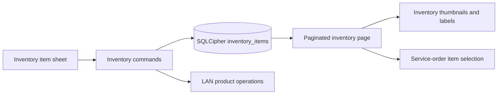

# Inventory Items, Photos, and Customer Phone Design

**Spec**: `.specs/features/v0-5-2-inventory-items-photos-customer-phone/spec.md`
**Status**: Approved

## Architecture Overview

`inventory_items` gains an `item` type, a `tracks_stock` flag, and an optional
bounded `photo_data_url`. Parts retain stock tracking and services retain
unlimited availability. Generic items expose the user-selected stock mode.
The existing local command and LAN facade serialize the same camelCase model.



## Code Reuse Analysis

| Component | Location | How to use |
| --- | --- | --- |
| Numbered migrations | `src-tauri/src/database.rs` | Add one transactional schema migration for the three inventory columns/constraint update. |
| Inventory model/repository | `src-tauri/src/models/inventory_item.rs`, `src-tauri/src/repositories/inventory_repo.rs` | Add `tracks_stock` and `photo_data_url` to every mapped inventory record. |
| Attachment image validation | `src-tauri/src/attachment_service.rs` | Reuse magic-byte validation rules for PNG/JPEG/WebP without introducing a file-store lifecycle. |
| Data URL logo convention | `src/views/Settings.tsx`, settings commands | Reuse data-URL payload handling for a single image persisted by SQLCipher. |
| Paginated query convention | `src/views/Inventory.tsx` | Add a third paginated query with type and page state in its query key. |
| Item selector | `src/components/shared/ServiceOrderItemsEditor.tsx` | Derive availability and labels from `tracksStock`, rather than hard-coding `part`. |
| Customer validation | `src/lib/validation.ts`, `src/views/Customers.tsx` | Keep phone validation mandatory and apply optional validation to non-empty email/address values. |

## Components

### Inventory schema migration

- **Purpose**: Upgrade fresh and existing databases without altering existing
  part/service behavior.
- **Location**: `src-tauri/src/database.rs`
- **Interfaces**: `inventory_items.type IN ('part', 'service', 'item')`,
  `tracks_stock INTEGER NOT NULL`, `photo_data_url TEXT`.
- **Dependencies**: numbered migration ledger, encrypted recovery backup.
- **Reuses**: existing transaction/migration test pattern.

### Inventory stock policy

- **Purpose**: Centralize whether an inventory record consumes stock.
- **Location**: `src-tauri/src/models/inventory_item.rs`, inventory and
  service-order commands/repositories.
- **Interfaces**: `InventoryItem::tracks_stock()` resolves true for parts,
  false for services, and the persisted choice for generic items.
- **Dependencies**: migrated record mapping.
- **Reuses**: existing restock, removal, and service-order lifecycle logic.

### Item photo form and thumbnail

- **Purpose**: Select, validate, preview, replace, remove, and list one photo.
- **Location**: `src/components/shared/InventoryItemSheet.tsx`,
  `src/views/Inventory.tsx`.
- **Interfaces**: `photoDataUrl?: string | null`, `tracksStock: boolean`.
- **Dependencies**: inventory command payloads and paginated page responses.
- **Reuses**: shared input/button primitives and invalidated inventory query
  prefix.

### Customer contact validation

- **Purpose**: Keep phone required and optional fields conditionally valid.
- **Location**: `src/lib/validation.ts`, `src/views/Customers.tsx`,
  service-order customer creation paths.
- **Dependencies**: existing empty-string customer storage.
- **Reuses**: `formatBRPhone`, Zod schemas, and LAN product operations.

## Data Models

```typescript
type InventoryType = "part" | "service" | "item";

interface InventoryItem {
  type: InventoryType;
  tracksStock: boolean;
  photoDataUrl?: string | null;
}
```

Fresh and migrated records use these invariants:

- `part` always has `tracks_stock = 1`.
- `service` always has `tracks_stock = 0`.
- `item` persists the user-selected flag.
- `photo_data_url` is null or a validated PNG/JPEG/WebP data URL sourced from
  no more than 1 MiB of bytes.

## Error Handling Strategy

| Error scenario | Handling | User impact |
| --- | --- | --- |
| Unsupported/oversized item photo | Reject before saving and preserve stored photo. | Portuguese field error; no data loss. |
| Stock removal for catalog-only item | Reject in Rust command. | Existing friendly stock-operation error. |
| Generic item lacks stock in service order | Block only when `tracks_stock` is true. | User cannot over-sell tracked inventory. |
| Blank customer email/address | Persist empty strings. | Customer saves normally. |
| Invalid supplied email/address | Reject frontend validation. | Existing Portuguese field error. |

## Risks & Concerns

| Concern | Location | Impact | Mitigation |
| --- | --- | --- | --- |
| Stock decisions are currently hard-coded as `type == "part"`. | `src-tauri/src/commands/inventory_commands.rs`, `src-tauri/src/repositories/service_order_repo.rs` | Generic items could be incorrectly consumed or unlimited. | Replace all inventory stock decisions in scope with the shared stock-policy predicate and cover lifecycle tests. |
| The inventory page has independent part/service pagination state. | `src/views/Inventory.tsx` | A third list can regress page reset/clamping or cache isolation. | Give items independent query key, page, size, reset, and clamp coverage. |
| List payloads include photo data URLs. | `src-tauri/src/repositories/inventory_repo.rs` | Large photos can inflate paginated LAN responses. | Enforce 1 MiB source-image limit and page size remains bounded. |
| Inventory type is validated in local commands and LAN facade separately. | `src-tauri/src/commands/inventory_commands.rs`, `src-tauri/src/lan_api.rs` | Local and LAN behavior can diverge. | Add exact item-mode contract tests through both paths. |

## Tech Decisions

| Decision | Choice | Rationale |
| --- | --- | --- |
| Photo persistence | SQLCipher `photo_data_url` column | One bounded photo stays encrypted and automatically participates in existing database backup/LAN transport. |
| Generic item availability | Persist `tracks_stock` | Supports both requested modes without introducing another inventory type. |
| Historical service-order rows | Preserve stored `item_type` | Existing orders remain auditable after an inventory item’s current stock mode changes. |
