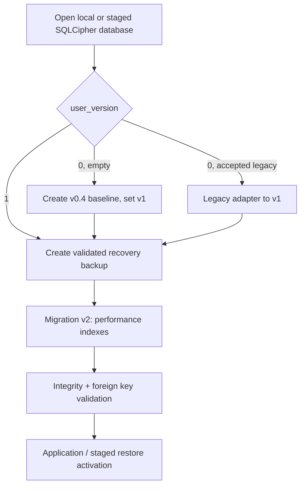

# Versioned Migrations and Performance Indexes Design

**Spec**: `.specs/features/versioned-migrations-performance/spec.md`
**Status**: Draft

## Architecture Overview

The migration runner becomes the sole owner of `PRAGMA user_version`. A
version-zero database is classified before mutation: an empty database receives
the v0.4.0 baseline, while a previously accepted legacy backup uses the
existing compatibility transforms to reach that baseline. Numbered migrations
then run in ascending order, one `BEGIN IMMEDIATE` transaction at a time.

Version 2 contains the two measured indexes. The financial query changes to use
the indexed local-date column already populated by the baseline schema.

## Code Reuse Analysis

| Existing component | Location | How to use |
| --- | --- | --- |
| `run_migrations` and current compatibility transforms | `src-tauri/src/database.rs` | Extract the current baseline setup and legacy adaptation behind explicit version classification. |
| Encrypted export and backup validation | `src-tauri/src/backup_service.rs` | Create and validate the recovery archive before pending on-disk migration. |
| Staged restore | `src-tauri/src/backup_service.rs` | Keep migration and validation entirely in staging before activation. |
| Financial report fixture tests | `src-tauri/src/repositories/financial_report_repo.rs` | Extend the existing report fixture with semantic and `EXPLAIN QUERY PLAN` assertions. |
| Template repository tests | `src-tauri/src/repositories/checklist_repo.rs` | Extend paginated item retrieval tests with index-plan assertions. |
| Ignored 10,000-record benchmark | `src-tauri/src/performance_benchmarks.rs` | Add named complete-report and template-page measurements. |

## Components

### Migration runner

- **Location**: `src-tauri/src/database.rs`
- **Purpose**: Classify schema state, apply ordered database migrations, and
  verify successful completion.
- **Interfaces**:
  - `run_migrations(conn, context)` applies baseline adaptation and all pending
    numbered migrations.
  - `MigrationContext` optionally carries on-disk database and attachment paths
    for recovery backup creation; in-memory callers use no backup context.
- **Dependencies**: `rusqlite::Connection`, backup service, storage paths.
- **Reuses**: current `run_schema_migrations`, `add_column_if_missing`, money
  migration, and schema validation helpers.

### Legacy baseline adapter

- **Location**: `src-tauri/src/database.rs`
- **Purpose**: Preserve the current accepted historical-schema transformations,
  then mark successful adaptation as version 1.
- **Dependencies**: existing legacy table/column transforms.
- **Rule**: It is only reachable for version-zero compatible schemas. New
  numbered migrations never perform table-rebuild compatibility work.

### Version-2 index migration

- **Location**: `src-tauri/src/database.rs`
- **Purpose**: Create `idx_service_orders_customer_created` and
  `idx_template_items_template` within one migration transaction.
- **Dependencies**: version-1 `created_date`, `service_orders`, and
  `template_items` tables.

### Reporting and checklist query evidence

- **Locations**: `src-tauri/src/repositories/financial_report_repo.rs`,
  `src-tauri/src/repositories/checklist_repo.rs`
- **Purpose**: Keep the report's business semantics unchanged while asserting
  that the two query paths use their new indexes.

## Data Models

| Version | Meaning | Migration behavior |
| --- | --- | --- |
| 0 | New, historical, or unversioned database | Classify; bootstrap a fresh database or adapt an accepted legacy database to v1. |
| 1 | v0.4.0 schema baseline | Eligible for numbered migrations. |
| 2 | v0.4.0 baseline plus performance indexes | Current target for this initiative. |

`PRAGMA user_version` is the only ledger. The current version is set inside the
same transaction as its schema migration. A version above 2 fails before any
mutation.

## Error Handling Strategy

| Error scenario | Handling | User impact |
| --- | --- | --- |
| Recovery archive cannot be created or validated | Stop before the first pending on-disk migration. | Startup fails safely; original database remains unchanged. |
| Migration SQL or failpoint fails | Roll back the `IMMEDIATE` transaction and retain the prior version. | Startup fails safely; recovery archive remains available. |
| Version is newer than supported | Stop before mutation. | User is told this application is older than the database. |
| Legacy backup fails schema validation | Reject staged restore before activation. | Active data is untouched. |
| Integrity or foreign-key check fails after migration | Treat as failure; do not continue startup or activate staging. | Recovery backup/staged original remains available. |

## Risks & Concerns

| Concern | Location | Impact | Mitigation |
| --- | --- | --- | --- |
| Current cumulative migration routine mixes baseline creation, legacy table rebuilds, and future changes. | `src-tauri/src/database.rs:601` | A naïve version number could skip required legacy transforms. | Classify version-zero databases and preserve the existing compatibility adapter before setting v1. |
| Recovery backup helpers currently operate from storage paths, while test callers use in-memory connections. | `src-tauri/src/database.rs:594`; `src-tauri/src/test_helpers.rs:93` | Forcing a backup everywhere would break isolated tests. | Use an explicit optional migration context; only on-disk startup needs recovery export. |
| Existing financial metric wraps `previous.created_at` in `date()`. | `src-tauri/src/repositories/financial_report_repo.rs:126` | SQLite cannot use a date-column index for the correlated predicate. | Compare `previous.created_date` directly and assert the plan. |
| Benchmark currently reports list comparisons but not the full report timing or template query plan. | `src-tauri/src/performance_benchmarks.rs:357` | Roadmap completion cannot be evidenced. | Add named measurements and record them in the performance document. |

## Tech Decisions

| Decision | Choice | Rationale |
| --- | --- | --- |
| Ledger | `PRAGMA user_version` | Native SQLite version ledger with transactional updates. |
| Baseline | Version 1 is the v0.4.0 schema | Direct upgrade support begins from the current release. |
| Legacy backups | Compatibility adapter before v1 | Preserves currently accepted older backup imports without claiming every historical live schema is a direct-upgrade fixture. |
| Index delivery | Version 2 | Both indexes are required for the same measured performance initiative and can be atomically installed together. |
